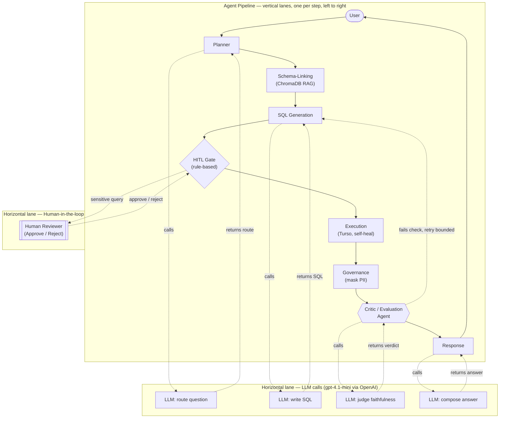
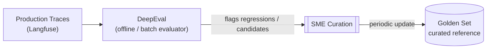

# TrustQuery AI — Multi-Agent Orchestration Flow

Use-case flow for a single user query: vertical lanes are the agents/steps the
query moves through, left to right. Two horizontal lanes underneath the main
pipeline break out calls into cross-cutting resources — the LLM and the human
reviewer — so it's clear which steps reach outside the agent pipeline itself
and which stay purely internal. The offline DeepEval evaluation loop is a
separate diagram further down — it runs on its own schedule, independent of
any single query.

Rendered with [Mermaid](https://mermaid.js.org/) — displays natively on GitHub
and in VS Code (with the Mermaid preview extension).

## Live query flow

### Reading this diagram

- **Top lane (Pipeline)**: the actual sequence a query moves through, in
  order. Every step here runs inside the LangGraph process — no external
  calls happen unless a dashed line drops down to one of the two lanes below.
- **LLM lane**: four of the nine steps call out to the LLM — Planner (routes
  the question), SQL Generation (writes the query), Critic (judges the
  result), Response (composes the final answer). Schema-Linking, HITL Gate,
  Execution, and Governance do **not** call an LLM — they're retrieval, a
  rule-based check, a DB call, and deterministic masking, respectively.
- **HITL lane**: only the HITL Gate reaches into this lane, and only when the
  generated SQL touches a PII/confidential-tagged column. Every other step
  skips it entirely.
- **Retry loop**: the Critic is the only step with an edge going *backward*
  in the pipeline (back to SQL Generation) — bounded by the shared
  `retry_count`/`max_self_heal_retries` budget it shares with Execution's own
  self-heal retries on DB errors.

## Offline evaluation loop (separate — not part of the live query flow)

DeepEval scoring against the golden set is a manual/CI `pytest` run today
(`evaluation/deepeval_tests.py`), not something that fires per live query.
This diagram shows the target design for that loop; only the DeepEval-against-
golden-set part is built, everything downstream of it (auto-flagging from
production traces, SME curation, golden-set auto-update) is still proposed.

**Status**: only `DeepEval` reading `golden_set.yaml` directly (manual/CI
`pytest` run) is implemented. `Traces → DeepEval` (DeepEval doesn't read
Langfuse traces today), `SME Curation`, and the auto-update of `Golden Set`
are all proposed, not built. The live Critic agent (see the diagram above)
does **not** read from `Golden Set` in this version — see `CLAUDE.md` for why
that's deferred.
