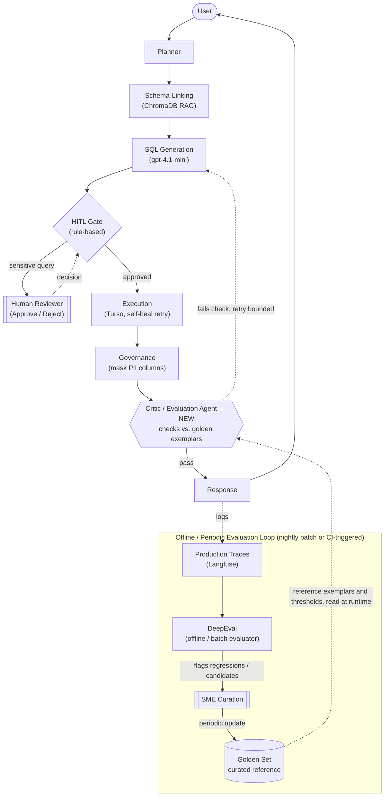

# TrustQuery AI — Multi-Agent Orchestration Flow

Architectural flow between agents for a single user query, plus the offline
evaluation loop that keeps the golden reference set current. Rendered with
[Mermaid](https://mermaid.js.org/) — displays natively on GitHub and in VS Code
(with the Mermaid preview extension).

## Legend

- **Solid arrows** — live, per-query path through the agent graph.
- **Dashed arrows** — the HITL branch, or offline/periodic flow.
- **Critic / Evaluation Agent** — not yet implemented in the MVP graph; shown as
  the natural place for a runtime self-check against the golden set, distinct
  from DeepEval's offline scoring.

## How the golden set actually gets updated

DeepEval does **not** write to the golden set directly — it scores production
traces against the *existing* golden set and flags regressions or candidate
new examples. An SME then reviews those flags and curates the update. That
refreshed golden set is what the (proposed) Critic/Evaluation Agent would read
from at runtime — DeepEval and the Critic Agent both consume the same golden
set, but on different cadences (periodic/offline vs. every query).
